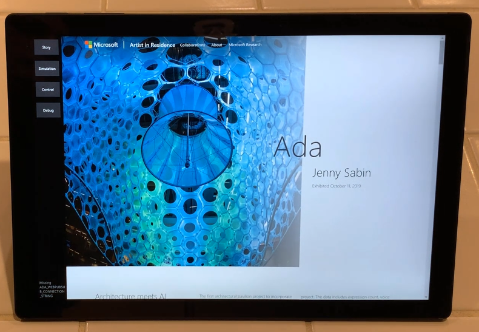

# Ada Kiosk

So I needed to run my nice [AdaKiosk app](https://github.com/microsoft/ada/tree/main/AdaKiosk) in locked down kiosk mode
on my Surface Pro device so it can accompany the awesome [Ada Installation in Microsoft
Research](https://www.microsoft.com/artist-in-residence/collaborations/ada/)



Click here to [watch a boot demo video.](AdaKioskBoot.mp4).

And I already had the app, written in .NET 5.0 WPF.  All I needed
to do then is make it run in Kiosk mode right?

Well it turns out that Windows 10 and 11 Kiosk mode do not support
running Desktop apps and my WPF app is a desktop app.  I would need to
port it to UWP but I can't do that for other reasons.  Believe me I
tried, the WPF will not run in Kiosk mode, I just get a blank screen.

But fortunately there's another feature of Windows 10 called
[Multi-app AssignedAccess](https://docs.microsoft.com/en-us/windows/configuration/lock-down-windows-10-to-specific-apps).  Getting this to
work was a bit tricky, so I'm sharing the info here.

First off there's a known bug in Windows 11 that blocks this from working
due to the [missing "tablet mode"](https://answers.microsoft.com/en-us/windows/forum/all/tablet-mode-in-window-11/d5a312f2-aa5e-4427-9b4e-7d0cc98f90ec) so I had to revert my device back
to Windows 10.  There's a [nice feature of Windows 11](https://answers.microsoft.com/en-us/windows/forum/all/downgrade-from-windows-11-to-windows-10/84a2416d-ccfb-4d87-9eee-e1056591e91f) that makes this easy.

Then I had to create a new user account and enable AutoLogon.  But you can't do that if Windows Hello is enabled, so I
had to remove my Windows Hello Pin, then I can setup this new account for auto login by using `NETPlwiz` as [shown
here](https://www.techjunkie.com/setup-auto-login-windows-10/), select the new account, and clear the checkbox requiring
a passord, this prompts for the password to use.  This gets auto login to work, now all I need is restricted the allowed
apps to my single kiosk app and make it run automatically on login.

The following XML file achieves this:

```xml
<?xml version ="1.0" encoding="utf-8"?>
<AssignedAccessConfiguration
    xmlns="http://schemas.microsoft.com/AssignedAccess/2017/config"
    xmlns:rs5="http://schemas.microsoft.com/AssignedAccess/201810/config"
    >
	<Profiles>
		<Profile Id="{fe3b713e-7ce1-4021-8ac9-fab8717713fb}">
			<AllAppsList>
				<AllowedApps>
					<App DesktopAppPath="c:\temp\AdaKiosk\AdaKiosk.exe" rs5:AutoLaunch="true"/>
				</AllowedApps>
			</AllAppsList>
			<StartLayout>
				<![CDATA[<LayoutModificationTemplate xmlns:defaultlayout="http://schemas.microsoft.com/Start/2014/FullDefaultLayout" xmlns:start="http://schemas.microsoft.com/Start/2014/StartLayout" Version="1" xmlns="http://schemas.microsoft.com/Start/2014/LayoutModification">
                      <LayoutOptions StartTileGroupCellWidth="6" />
                      <DefaultLayoutOverride>
                        <StartLayoutCollection>
                          <defaultlayout:StartLayout GroupCellWidth="6">
                            <start:Group Name="Ada">
                              <start:DesktopApplicationTile Size="4x4" Column="0" Row="0" DesktopApplicationLinkPath="c:\temp\AdaKiosk\AdaKiosk.lnk" />
                            </start:Group>
                          </defaultlayout:StartLayout>
                        </StartLayoutCollection>
                      </DefaultLayoutOverride>
                    </LayoutModificationTemplate>
                ]]>
			</StartLayout>
			<Taskbar ShowTaskbar="false"/>
		</Profile>
	</Profiles>
	<Configs>
		<Config>
			<Account>adatablet\ada</Account>
			<DefaultProfile Id="{fe3b713e-7ce1-4021-8ac9-fab8717713fb}"/>
		</Config>
	</Configs>
</AssignedAccessConfiguration>
```

Botice I had to also create a shortcut to the app for the start menu.
Apparently this must be a shortcut (.lnk file).

I decided to skip the provisioning package approach and went for the
PowerShell.  This can be done using the [MDM Bridge WMI Provider](https://docs.microsoft.com/en-us/windows/configuration/kiosk-mdm-bridge).

Step (2) in this page is critical.  The powershell script must be run
from a special `cmd.exe` prompt that is created using `psexec.exe -i -s cmd.exe`.

The script is:

```powershell
$nameSpaceName="root\cimv2\mdm\dmmap"
$className="MDM_AssignedAccess"
$obj = Get-CimInstance -Namespace $namespaceName -ClassName $className
Write-Host "got instance $obj.Configuration"
Add-Type -AssemblyName System.Web
$xml = Get-Content -Path "AssignedAccessConfig.xml" -Encoding "utf8" | Out-String
$html = [System.Web.HttpUtility]::HtmlEncode($xml)
$obj.Configuration = $html
Set-CimInstance -CimInstance $obj
```

Where the xml file is the one I included above.  The HtmlEncode here
is a mystery, but it is required!

That's it.  Reboot and bingo you get the auto-login and auto-start
of my kiosk app.  Nice.  Everything is pretty nicely locked down.
One trick I tested was to see if I could use the soft keyboard to
jump over to the Keyboard Settings and from there you can mess with
any settings, but that stops with "Blocked by your system administrator".
Cool.  I could even extend this and have multiple apps selectable from a
customized start page if I wanted to.

## Stop Windows 11 Upgrade?

So now I have to stop Windows 11 upgrades from happening or even
showing up in the UI because Windows 11 will break my Kiosk.
I did that using the Group Policy Editor trick [shown here](https://www.howtogeek.com/765377/how-to-block-the-windows-11-update-from-installing-on-windows-10/#autotoc_anchor_2).  This removes all the prompts telling me to updade
to Windows 11.

## Reset

It's also handy to know how to undo all this, and the following script
removes the Assigned Access configuration:

```powershell
$nameSpaceName="root\cimv2\mdm\dmmap"
$className="MDM_AssignedAccess"
$obj = Get-CimInstance -Namespace $namespaceName -ClassName $className
Write-Host ($obj | Format-List | Out-String)
$obj.Configuration = $null
Set-CimInstance -CimInstance $obj
```