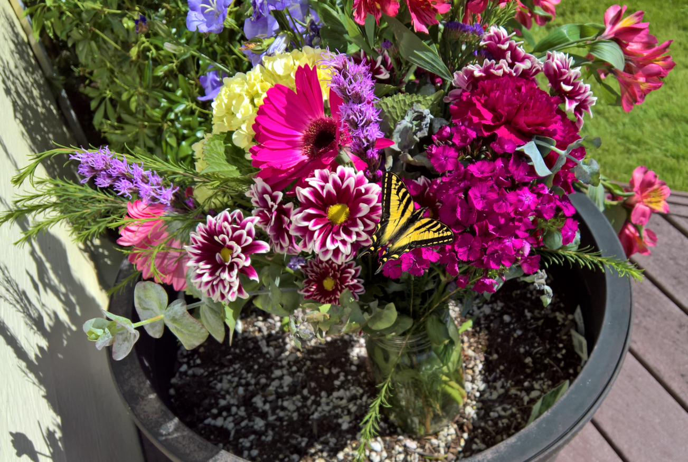

# Western Tiger Swallowtail

One of the best butterflies you will see in the Northwest Region of the United States
is the Western Tiger Swallowtail.  I put this flower arrangement outside one day and
to my amazement it attracted a beautiful specimen. She was so enthralled by the
flowers she let me walk right up close with my phone camera:

This is an older male in July, wings a bit tatty, but it loves the wild Rose Campions
that we get around here:

<video width="763" height="429" controls autoplay muted loop>
<source src="../../images/TigerSwallowtail.mp4" type="video/mp4">
Your browser does not support the video tag
</video>

