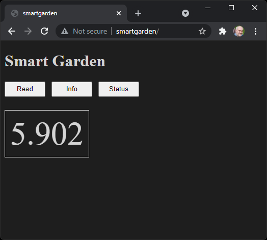

# Tower Garden Yumminess!

I love gardening and I first learned about this really good [Tower
Garden](https://www.towergarden.com/) at Microsoft where they have a bunch of them around campus and
they used to grow food for the salad bar back in those days when people used to actually go into the
office.

So instead of waiting for coronavirus to piss off I decided to splurge a little and get myself one
of these nifty indoor vertical gardens.  I'm happy to report assembly was easy, and within
practically no time at all I was loaded with fresh greens.

I still have a vege garden outside, but out there I have to constantly battle with the rabbits,
deer, and the ever present slugs.  Indoors the produce is so perfect it is crazy, every leaf is full
vibrant perfection, not the slightest damage from pests, and with no insecticides it is super
healthy and ready to eat any time.

The thing runs itself, it has automatic lighting on 12 hours per day and  the tank holds lots of
water and a automatic timer on the pump runs the water down the inside of the tower ever 15 minutes
so, no matter what, the plants are happy.  Once a week I top up the tank with fresh water with these
nutrients they provided, about 20ml per gallon:

Then the last step is to keep the pH balanced.  My filtered tap water is about pH 7.1, but the
nutrients are slightly acidic, so normally I need about a teaspoon of alkali to keep the tank in
the recommended range of 5.5 to 6.5. They provided a nice little test kit:

So this is about 10 minutes once a week.  Planting is easy whenever I devour one of the plants that
is ready for harvesting I simply plop in a new starter.  You can buy the starter plants from Tower
Garden, or grow them yourself from seeds. They provide an easy way to do that too.

All up the entire system works really well.  I've had it now for about 2 months and it has produced
all the leafy greens I need for me and Heidi for the last month already.  I also have some yummy
herbs growing, from Chocolate Mine, to Italian Parsley, and a huge basil.  I've never seen such huge
basil leaves before and they taste amazing.

## Tinkering...

Of course, I would not be satisfied with just that, I need to tinker with it. My son, Zach, found
this awesome [hydroponic system built by Kyle
Gabriel](https://kylegabriel.com/projects/2020/06/automated-hydroponic-system-build.html).

So that's my target, the most useful thing to start with is automated pH sensing. Karl chose really
nice pH sensor from Atlas Scientific for his system so I got the same one from Amazon.  I also
wanted to use my [Teensy 4.1](https://www.pjrc.com/store/teensy41.html) with the [Ethernet
Kit](https://www.pjrc.com/store/ethernet_kit.html) because it can talk directly to the sensor over
UART, and serve up a nice little HTTP server on my local network.

Getting it hooked up was easy, just drop the sensor in the tank:

and connect it to my Teensy, plug my Teensy into the network and voilà !

Any web browser in my house can now check the pH levels:

Great.  So no need for the liquid pH test kit, I now have a much more accurate number.
Here I see a pH level of 5.9 which is ok.  I see an very quick response any time I add acid or alkali
to the tank.

The Teensy 4.1 source code lives here [https://github.com/lovettchris/SmartGarden](https://github.com/lovettchris/SmartGarden).

Next step the automatic pumping of acid/alkali to keep it balanced...  fun fun fun...