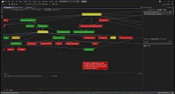
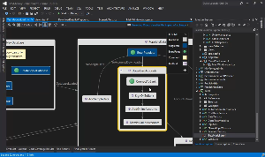
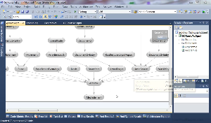
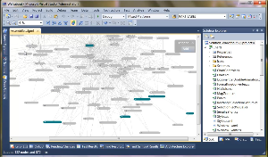

# Videos

[ DGML Tour](https://youtu.be/wIjCdOrZj-I)

[ MyMoney](https://lovettsoftwarestorage.blob.core.windows.net/videos/MyMoney.mp4)

[ Refactoring code the fun way](https://lovettsoftwarestorage.blob.core.windows.net/videos/CoyoteRefactoring.mp4)

[ [Using DGML to understand PX4](https://lovettsoftwarestorage.blob.core.windows.net/videos/PX4_Topics.mp4)

[ [AirSim with PX4 in HITL mode using Firmware version 1.9.0](https://lovettsoftwarestorage.blob.core.windows.net/videos/AirSimPx4v9.mp4)

[ [Runing AI on IoT microcontroller devices with ELL](https://lovettsoftwarestorage.blob.core.windows.net/videos/ELL_MXCHIP_Oct2018.mp4)

[ [Ble Lights](https://lovettsoftwarestorage.blob.core.windows.net/videos/BleLights.mp4)

[ [Wifi Lights](https://lovettsoftwarestorage.blob.core.windows.net/videos/WifiLights.mp4)

[ [Outlook Sync](https://lovettsoftwarestorage.blob.core.windows.net/videos/OutlookSync.mp4)

[ [Password Vault](https://lovettsoftwarestorage.blob.core.windows.net/videos/PasswordVault.mp4)

[ [Pinweight Devices](https://lovettsoftwarestorage.blob.core.windows.net/videos/PinweightDev.mp4)

[ [Dgml Test Modeling](https://lovettsoftwarestorage.blob.core.windows.net/videos/DgmlTestModel.mp4)

[ [Software Trails](https://lovettsoftwarestorage.blob.core.windows.net/videos/SoftwareTrails.mp4)

[ [Energy Hub](https://lovettsoftwarestorage.blob.core.windows.net/videos/EnergyHub.mp4)

[ [FIRST Event Planner](https://lovettsoftwarestorage.blob.core.windows.net/videos/FIRST%20Event%20Planner.mp4)

[ [GC Root Demo](https://lovettsoftwarestorage.blob.core.windows.net/videos/GCRootDemo.mp4)

[ [Large Graphs](https://lovettsoftwarestorage.blob.core.windows.net/videos/LargeGraphs.mp4)

[ [What’s new with DGML](https://lovettsoftwarestorage.blob.core.windows.net/videos/WhatsNew.mp4)

[ [Architecture Explorer](https://lovettsoftwarestorage.blob.core.windows.net/videos/ArchitectureExplorer.mp4)

[ [Standard Graphs](https://lovettsoftwarestorage.blob.core.windows.net/videos/StandardGraphs.mp4)

[ [Graph Documents](https://lovettsoftwarestorage.blob.core.windows.net/videos/GraphDocuments.mp4)

