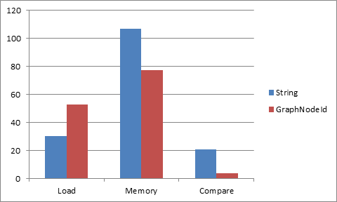
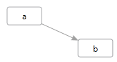
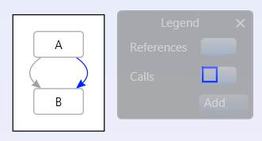
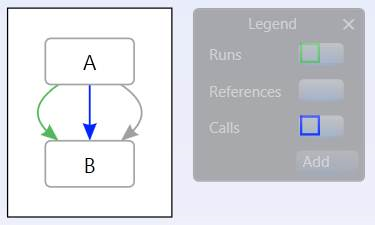
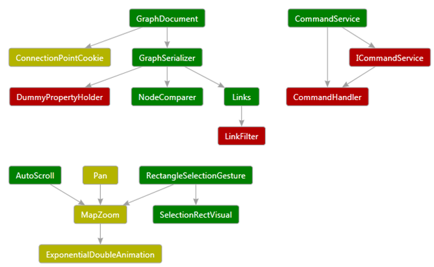
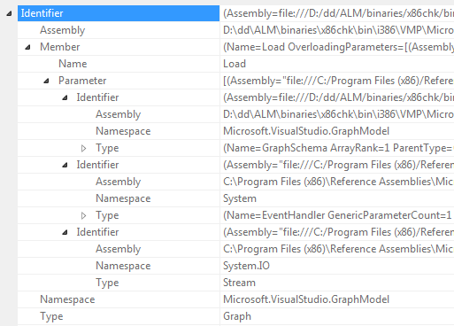

# DGML Graph Model Specifications

The Directed Graph Markup Language (.dgml) features of Visual Studio Ultimate are built on a node/link graph data model.  This data is persisted in DGML documents which is an XML format.  While it is possible to edit the XML directly, it is not fun or productive.  The Graph Model API provides an in-memory representation that is natural for manipulating directed graphs and has become the foundation of all the dependency analysis features in VS Ultimate.  For this reason the API has been made available anyone extending Visual Studio.

### Goals

- Performance: Being the platform for lots of features the model needs to be as fast as possible.
- Usability: Close behind however is the fact that the API needs to be simple to use
- Convenience: Where practical helper methods are provided for added convenience, but this is not the top priority of this API.  Helper libraries can always be provided out of band or as sample code.
- Thread safe: Some amount of thread safety and thread isolation is nice for this level of API

### Non-Goals

The API does not attempt to be the front end to a database.

## Design

The [Complete Graph Model API](https://docs.microsoft.com/en-us/dotnet/api/microsoft.visualstudio.graphmodel?view=visualstudiosdk-2017
) is available on MSDN.  This spec just outlines the core concepts that must be understood in order to use this API.  The Graph model can serialize itself to and from the DGML XML format.

### GraphNodeId

In order to support first class serialization and decoupling of graph operations across components, or in databases, it is important to name the objects in a graph carefully. To this end the Graph Model does not use System.String to name things.  The GraphNodeId class is used instead.  GraphNodeId is a structured identifier that composes nested sets of Name=Value pairs, for example, you can create a GraphNodeId that points to an Assembly like this:

```csharp
GraphNodeId mscorlib = GraphNodeId.GetPartial(CodeNames.AssemblyName,
    new Uri(typeof(string).Assembly.Location));
```
This serializes to the following string format:

```
	(Assembly=file:///C:/Windows/Microsoft.NET/Framework/v4.0.30319/mscorlib.dll)
```

Then you can name the System Namespace inside mscorlib by composing the following two names together:

```csharp
GraphNodeId system = mscorlib + GraphNodeId.GetPartial(CodeNames.NamespaceName, "System");
```

Then you can name the String Class by adding on to the name of the namespace:

```csharp
GraphNodeId str = system + GraphNodeId.GetPartial(CodeNames.TypeName, "String");
```

Then you can name the Join method by adding to the name of the class:

```csharp
GraphNodeId join = str + GraphNodeId.GetPartial(CodeNames.Name, "Join");
```

The result is an identifier that remembers the structure you used to build the name and this structure can also be serialized to and from the following string format:

```
(Assembly=file:///C:/Windows/Microsoft.NET/Framework/v4.0.30319/mscorlib.dll Namespace=System Class=String Method=Join)
```

This sort of composition of names allows the application to avoid having to do lots of expensive string parsing operations every time it needs a part of the name.  It also provides hashing advantages so that comparing identifiers is a lot faster and the overall memory used is much less than using strings.

As you can imagine, naming everything in mscorlib results in many redundant Assembly, Namespace, Class sub strings, so building up identifiers using string addition would be very expensive:
```
string mscorlib = “Assembly=file:///C:/Windows/Microsoft.NET/Framework/v4.0.30319/mscorlib.dll”;
string system = mscorlib + “ Namespace=System”;
string stringClass = system + “ Type=String”;
string joinMethod = stringClass + “Method=Join”;
```
The following table shows the comparison between System.String and GraphNodeId in construction time, comparison and total memory usage measured using all the identifiers in System.Xml.Linq.dll (about 2000 identifiers) and about 4 million comparisons (comparing every identifier against every other).



The construction time for the GraphNodeId’s here is the worst case and assumes no reuse of in memory ids.  For example, it recreates the Assembly id over and over rather than holding onto one GraphNodeId pointer for that assembly.  This is not typically how the product code will work, but it is the worst case.  It is how Serialization would work, so it essentially measures serialization load time.  For that reason strings are faster to load, but you can see that memory usage and comparison time, GraphNodeId wins considerably, this is because GraphNodeId is “atomized”, so that comparison can be a simple object reference comparison.

Note: string.Intern doesn’t help the string case here because every identifier is different, and string.Intern would add substantial hit to load time, which would make it slower than GraphNodeId.

GraphNodeId registration is static so they employ a WeakReference system to garbage collect ids that are not used.

### GraphNodeId Value Types

The GraphNodeId values can be any type that can be converted to/from a string using TypeConverter. However, the following types are well supported:

- String: "Namespace=System.Collections".
- Uri: "Assembly=file://mscorlib.dll".
- GraphNodeIdCollection: "ParentType=(Assembly=file://mscorlib.dll Namespace=System.Collections Type=ArrayList)".

### GraphNodeIdName

The name part is a static object called a `GraphNodeIdName`. The name also determines the type of value that the GraphNodeId can contain, and how a string should be parsed back during string serialization. For example, Namespace will be registered as string, but assembly as URI:

```csharp
class CodeNames
{
    public static GraphNodeIdName AssemblyName = GraphNodeIdName.Get("Assembly", "Assembly", typeof(Uri));
    public static GraphNodeIdName NamespaceName = GraphNodeIdName.Get("Namespace", "Namespace", typeof(string));
    public static GraphNodeIdName TypeName = GraphNodeIdName.Get("Type", "Type", typeof(object));
    public static GraphNodeIdName NameName = GraphNodeIdName.Get("Name", "Name", typeof(String));
    public static GraphNodeIdName GenericParameterCountName = GraphNodeIdName.Get("GenericParameterCount", "GenericParameterCount", typeof(int));
    public static GraphNodeIdName MemberName = GraphNodeIdName.Get("Member", "Member", typeof(Object));
    public static GraphNodeIdName OverloadingParametersName = GraphNodeIdName.Get("OverloadingParameters", "OverloadingParameters", typeof(GraphNodeIdCollection));
}

```
Notice the `GraphNodeIdName` objects are usually static so they can be shared by the whole process. There are also 3 special names for qualified identifiers. These are non-printed names, and are inferred during parsing.


- `GraphNodeIdName.Nested` – a list of GraphNodeIds
"(Assembly=file://mscorlib.dll Namespace=System Type=String)".
The data type of a Nested value is always GraphNodeIdCollection. In the above case, there are 3 nested identifiers:  Assembly, Namespace and Type.

- `GraphNodeIdName.Array` – represents a list of GraphNodeId’s where each item in the list has the same type. For example, the arguments to a method each have the same type “MethodParameter”, so think of the array as a way to lift the “MethodParameter” part out of the list, so instead of (MethodParameter=Value MethodParameter=Value MethodParameter=Value) you can say MethodParameter=[Value, Value, Value].  The data type of Array value is always GraphNodeIdCollection – with homogeneousItems =true.

- `GraphNodeIdName.Literal` - "Bing!".  The data type of a Literal is a String.

If a GraphNodeId is being constructed through parsing, and a name is not currently registered, a new name will be registered with a data type of System.Object.

If you want to reuse the same `GraphNodeIdName` in some places with a string value and in other places with a nested `GraphNodeIdCollection` then type the `GraphNodeIdName` as System.Object.

### Parsing & standard form

A standard GraphNodeId always has a Nested outer GraphNodeId, with one or more GraphNodeId inside. A GraphNodeId that's not part of a nested qualified identifier is said to be a partial qualified identifier.  This is why the following method is called GetPartial:

```csharp
GraphNodeId.GetPartial(CodeNames.NamespaceName, "System");
```
returns
```
"Namespace=System"
```
To make this a standard identifier wrap it in a GetNested call:

```csharp
GraphNodeId id = GraphNodeId.GetNested(
                     GraphNodeId.GetPartial(CodeNames.NamespaceName, "System")
                 );
```
This results in the following well formed identifier:
```
"(Namespace=System)"
```
This is important during parsing. Although it is possible to build a partial GraphNodeId using the .GetPartial() API, it is not possible to construct one using .Parse(). Instead, GraphNodeId.Parse("Namespace=System")will instead be parsed as a Literal:
```
- id2 {Namespace=System}	Microsoft.VisualStudio.GraphModel.GraphNodeId
  - LiteralValue "Namespace=System" string
  - Name {Literal} Microsoft.VisualStudio.GraphModel.GraphNodeIdName
  - Value	"Namespace=System"	object {string}
```
This is simply so that the parsing rules are simple, predictable, and as fast as possible.  Any GraphNodeID that is malformed will also be parsed as: "Name=Literal, Value=whatever"

### Nesting

The following shows how GraphNodeId can be nested to full identify not only a method, but all the fully qualified types of all the parameters.  The method we will describe is the following from mscorlib:

```
System.IEquatable<T>.Equals(System.IEquatable<T> other);
```

First we create some basic partial identifiers that can be reused:

```csharp
    GraphNodeId mscorlib = GraphNodeId.GetPartial(CodeNames.AssemblyName, new Uri(typeof(string).Assembly.Location));
    GraphNodeId system = GraphNodeId.GetPartial(CodeNames.NamespaceName, "System");
    GraphNodeId iequatable = GraphNodeId.GetPartial(CodeNames.NameName, "IEquatable");
    GraphNodeId equals = GraphNodeId.GetPartial(CodeNames.NameName, "Equals");
```
Next we build a nested identifier representing the generic type `IEquatable<T>`, which is represented by combining a GenericParameterCountName of 1 with the name "IEquatable".  The fact that the generic parameter is called T does not need to be remembered here:
```csharp
    GraphNodeId iequatableGeneric = GraphNodeId.GetNested(new GraphNodeId[] {iequatable, GraphNodeId.GetPartial(CodeNames.GenericParameterCountName, 1) });
```
Now we can say `TypeName=IEquatable<T>` like this:
```csharp
    GraphNodeId typeName = GraphNodeId.GetPartial(CodeNames.TypeName, iequatableGeneric);
```
Now we can describe the method parameters using this nested name:
```csharp
    GraphNodeId methodParameters = GraphNodeId.GetPartial(CodeNames.OverloadingParametersName,
        new GraphNodeIdCollection(true, GraphNodeId.GetNested(new GraphNodeId[] {
            mscorlib, system, typeName })));
```
Now we can describe the "Equals" method and it's parameters using this:

```csharp
    GraphNodeId method = GraphNodeId.GetPartial(CodeNames.MemberName,
        GraphNodeId.GetNested(new GraphNodeId[] { equals, methodParameters }));
```
Now we can fully type the method by adding assembly, namespace and type

```csharp
 GraphNodeId result = GraphNodeId.GetNested(new GraphNodeId[] {
       mscorlib, system, typeName, method });
```
This results in the following serialized identifier:
```
(Assembly="file://c:/Windows/Microsoft.NET/Framework/v4.0.30319/mscorlib.dll"  Namespace=System Type=(Name=IEquatable GenericParameterCount=1)  Member=(Name=Equals OverloadingParameters=[(Assembly = "file://c:/Windows/Microsoft.NET/Framework/v4.0.30319/mscorlib.dll" Namespace = System  Type = (Name = IEquatable GenericParameterCount = 1))]))}
```

Notice how in the construction of the GraphNodeId that many sub-parts can be shared across many GraphNodeIds and this is how it can achieve performance and memory wins.

### Core Model


The core graph model begins with the container called Graph. You can simply create a new empty Graph object as follows:

```csharp
Graph graph = new Graph();
```
This object can also be serialized to and from disk using the Load/Save methods (See Serialization for details):

```csharp
Graph graph = Graph.Load(dgmlFile);
```

A graph can contain Nodes and Links which you can add using the Nodes and Links collections:

```csharp
GraphNode a = graph.Nodes.GetOrCreate("a");
GraphNode b = graph.Nodes.GetOrCreate("b");
GraphLink link = graph.Links.GetOrCreate(a, b);
```
This could be visualized as the following:



The Graph model is fully editable, you can insert or delete any node or link, and all expected ripple effects are taken care of.  For example, when you add a Link, both end point nodes are added automatically if they are not there.  If you Remove a node, all Links connected to that node are removed automatically.  In this way the Graph is always left in a valid state after any editing operation.

Graph nodes and links cannot belong to multiple Graph objects at the same time.  If you add a node to a different Graph than it was created in, then that will become an “import” operation and a new GraphNode instance will be created.

To that end there are many helper methods dealing with copying subsets of a Graph to and from other Graph objects.  See Copy, ImportSubset  and Merge methods.

For improved performance you should always wrap edit operations in a `GraphTransactionScope`.  This will be covered in more detail below.

### Categories & Properties


The root `Graph`, `GraphNode` and `GraphLink` can all contain properties and categories.  There is a common base class called `GraphObject`.  GraphObject has a collection of Properties and Categories. For example, the following node has the category “Vegetable” and the “Background” property with the value “Green”:

```xml
<Node Id="A" Label="Tree" Category="Vegetable" Background="Green"/>
```
And the following node has the category “Element” and a “FontStyle” property with value “Italic”:

```xml
<Node Id="B" Label="Water" Category="Element" FontStyle="Italic"/>
```
The following link has the category “Drinks” with a “Weight” property with the value “5”.

```xml
<Link Source="A" Target="B" Category="Drinks" Weight="5" />
```

In code you get and set properties using the GetValue/SetValue/ClearValue methods, and you get or set categories using HasCategory and AddCategory, and RemoveCategory.

Properties and Categories can be used for all sorts of things.  The GraphModel itself has some special built in properties and categories used to describe some things like grouping.

`GraphCategory` and `GraphProperty` can also contain extra metadata describing what they are about.  You could think of a GraphCategory as a property that has no value. But categories have one other feature, namely, GraphObject can inherit properties defined on the GraphCategory and categories can inherit properties from other categories via a `BasedOn` property.  This allows you to setup loose taxonomies using this metadata system.

For example, we can promote the `Backgound` and `FontStyle` properties to the GraphCategory and thereby every node that has the Category="Vegetable" will be italic and every node with the Category="Element" will be blue.

```xml
<Category Id="Element" Background="Blue" />
<Category Id="Plant" FontStyle="Italic" />
```
Now anything with the category Plant will have a tree icon, including anything that has the category Tree, since the Tree category is “BasedOn” the Plant category.
```xml
<?xml version="1.0" encoding="utf-8"?>
<DirectedGraph GraphDirection="LeftToRight"
               xmlns="http://schemas.microsoft.com/vs/2009/dgml">
  <Nodes>
    <Node Id="A" Category="Tree" Label="Tree" />
    <Node Id="B" Category="Element" Label="Water" />
  </Nodes>
  <Links>
    <Link Source="A" Target="B" />
  </Links>
  <Categories>
    <Category Id="Element" Background="#FF0000FF" />
    <Category Id="Plant" FontStyle="Italic" />
    <Category Id="Tree" Icon="Tree.png" BasedOn="Plant" Shape="None" />
  </Categories>
  <Properties>
    <Property Id="Background" Label="Background" Description="The background color" DataType="System.Windows.Media.Brush" />
    <Property Id="GraphDirection" DataType="Microsoft.VisualStudio.Diagrams.Layout.LayoutOrientation" />
    <Property Id="Icon" Label="Icon" Description="Icon" DataType="System.String" />
    <Property Id="Shape" DataType="System.String" />
    <Property Id="FontStyle" DataType="System.Windows.FontStyle" />
  </Properties>
</DirectedGraph>
```
Which could be visualized like this:


Notice also that properties can have labels, datatypes and descriptions.

A “HasCategory” method is provided which will return true if the given category is found on the GraphObject or in anyway in the BasedOn chain.

To define your own properties and categories see Schemas.

### Grouping


A Graph can model the concept of grouping by using GraphLink to establish “Contains” relationships between two nodes and a “Group” property on the container node, like this:

```xml
<Nodes>
  <Node Id="Child" />
  <Node Id="Group" Group="Expanded" />
</Nodes>
<Links>
  <Link Source="Group" Target="Child" Category="Contains" />
</Links>
```
This describes a Graph that could be visualized like this:


Nested containments can be described the same way and the Graph model provides helper methods for finding ancestors and descendants along these “Contains” link relationships.


The GraphModel also allows any number of links between nodes, so you could model multiple containment relationships and create a Graph that could be visualized like this:


**Note**: Visual Studio does not support visualizing multi-containment.

The Graph Model even allows a child to contain a parent and a parent to contain a child.  This is called circular containment.  This can be tricky to program, so the Graph Model provides helper methods for searching for ancestors and descendants without getting stuck in infinite loops caused by circularity.

The Graph Model also provides a helper class called GraphGroup which wraps each GraphNode that has a Group property and exposes additional properties like ChildNodes and ChildGroups and Parents to make it even easier to deal with groups.

But it is important to note that GraphGroup is a helper class and just a wrapper object on GraphNode.  These objects are not constructed unless you ask for them and can come and go as the inner GraphNode is edited.

For additional convenience you can also set properties and categories on the GraphGroup object and that will be passed down to the inner GraphNode object.  So the GraphGroup always reflects the same categories and properties as the node that it wraps.

The Graph object then also provides the following helper methods for dealing with groups:
- AllGroups – returns a list of all GraphGroup objects
- Groups – returns a list of top level groups
- VisibleTopLevelGroups – returns  a list of visible top level groups
- FindCommonAncestor - return the common ancestor of all the given nodes
- FindGroup – return the GraphGroup wrapper for a node that has a Group property
- GetGroupDescendants – provides a way to walk the group hierarchy.


### MultiLinks

The Graph model can also support multiple links between the same two nodes:


These are known as multigraphs and are useful in modeling state machines where multiple different transitions can take you from one state to another.

GraphLinks are distinguished from each other by providing a unique “Index” property on each one using the following API:

```csharp
public GraphLink GetOrCreate(string sourceId, string targetId, int index)
public GraphLink GetOrCreate(GraphNodeId sourceId, GraphNodeId targetId, int index)
```

The index property that becomes part of the unique identifier of this link, so the unique identifier of a link is the source node id + target node id + index.  So the index only needs to be unique between the same two nodes.

If you specify an index that already exists then you will not be creating a new link, instead you will get back the existing link, which is the normal semantics for all Graph Model "GetOrCreate" methods.

You can find the link with specific index using the following new overloads:
```csharp
public GraphLink Get(string sourceId, string targetId, int index)
public GraphLink Get(GraphNodeId sourceId, GraphNodeId targetId, int index)
```

And you can find out what index a given link has using the following property
on GraphLink:
 ```csharp
public int Index { get; }
```
This returns an optional Index of this link.  Default is zero.
This index can be specified when you create a link, providing different index values makes it possible to create multiple links between the same source and target nodes.

The following graph is using multilinks where the “References” link has Index=1 and the "Calls" links has default index 0:



And if you copy & paste that into the following graph, where this link has been manually edited to have Index=3:


Then the link indexes will be preserved via serialization and you will get the following combined graph:



The idea is that the "Index" belongs to the end user, if they specify it, then they want it preserved.  The GraphModel does not do any automatic re-writing of link indexes.

### Searching Graphs

The following helper method makes navigating Graphs easier.
```csharp
public IEnumerable<GraphNode> FindRelatedNodes(GraphSearchDirection searchDirection, Predicate<GraphLink> traverseLink, Predicate<GraphNode> traverseNode, Predicate<GraphNode> acceptNode)
```
This method finds the dgml nodes that match the acceptNode predicate and are related in a way that matches the traverseLink and traverseNode predicates.

Nodes are found by doing a breadth first search along links matching the traverseLink predicate, in the Source or Target direction designated by the searchDirection parameter.

If the node matches the traverseNode predicate it keeps searching recursively through that node in the same direction and returns all nodes that match the acceptNode predicate. The search can handle circularity in the graph.

The following example searches through all nodes reachable via all links from the start node and returns all nodes that have the Method category:

```csharp
node.FindRelatedNodes(GraphSearchDirection.Target, l => true, n => true,
                       n => HasCategory(MethodCategory);
```

### Eventing (Change Tracking)

All changes to the graph model can be tracked using the following change events on the Graph object:

```csharp
public event EventHandler<GraphUpdatedEventArgs> Updated;
public event EventHandler<GraphUpdatedEventArgs> Updating;
```
The Updating method happens while a transaction is being committed so you can see the old property values before they are changed.   The Updated event happens after a successful Commit happens and the GraphUpdatedEventArgs contains all the changes that happened within that transaction.

You can listen to these events by doing the following:

```csharp
Graph g = new Graph();
g.Updated += OnGraphUpdated;
```

It is highly recommended that you use `GraphTransactionScope` when you change multiple objects in the Graph like this:

```csharp
using (var scope = g.BeginUpdate(Guid.NewGuid(), "Add stuff", UndoOption.Add))
{
    GraphNode foo = g.Nodes.GetOrCreate("foo");
    GraphNode bar = g.Nodes.GetOrCreate("bar");

    GraphLink calls = g.Links.GetOrCreate(foo.Id, bar.Id, 0);

    GraphLink references = g.Links.GetOrCreate(foo.Id, bar.Id, 1);

    scope.Complete();
}
```

Notice the important `scope.Complete()` call at the end of this block.  See the section on Transactions below.

When the transaction scope is completed, all these edits are rolled up into one batch operation so your OnGraphUpdated method will be given a GraphUpdatedEventArgs that contains the added nodes and added links:

```csharp
static void OnGraphUpdated(object sender, GraphUpdatedEventArgs e)
{
    var nodes = e.AddedNodes;
    var links = e.AddedLinks;
}
```
This style of batching up updates results in much more efficient processing in an application because UI objects can respond to graph changes in batch updates, rather than being evented to death with too many fine grained singleton events.

This style of batching also makes it trivial to implement Undo/Redo.

**Note**: there is an important rule that you must obey in your OnGraphUpdated events.  You must not create another GraphTransactionScope inside that event handler on the same Graph object.  If you do attempt to do this you will get an invalid operation exception.

If you really want fine grained events, you can also listen to the lower level PropertyChanged and CategoryChanged events on GraphObject.  This is useful for UI Data Binding scenarios.

### Undo/Redo Support

The following classes can be used to build an Undo/Redo stack for graph operations using the change tracking events

- GraphUndoUnit
- GraphUndoManager<T>
- UndoableGraphTransactionScope
- UndoOptions

### Transactions

As mentioned above in Eventing, it is highly recommended that you use `GraphTransactionScope`.  In fact, if you don’t use GraphTransactionScope then implicit scopes will be created for every individual edit, which can end up being a lot more expensive.

GraphTransactionScopes support the following features:
1. If your code throws an exception before the `scope.Complete` call then all the changes inside that scope are rolled back, leaving the Graph in a consistent state.
2. Other threads are isolated from your changes until `scope.Complete`.  This allows other threads to “read” the graph and see a consistent state until and your changes then appear atomically to them.  (**Note**: the Graph is not thread safe for Write operations. See Threading Model).
3. GraphTransactionScope supports nesting.  For example your could call a method and that method creates another GraphTransactionScope and completes it before returning back to you.  In this case the inner transaction is not really completed until the outer most GraphTransactionScope is completed.  Similarly, if the inner scope is aborted, it is not aborted until the outer GraphTransactionScope is completed.  Note: abort can be tricky, because an inner scope can cause all the outer scopes to be aborted.   This can be a source of bugs. See Trouble Shooting.

### Threading Model

The Graph object model is thread safe for “read” but not for “write”, there can only be one writer at a time.  The `GraphTransactionScopes` provide thread isolated storage, so each reader sees a consistent view of the Graph model until each transaction is committed or rolled back.  During commit however, the readers are not isolated while the changes stored in isolated storage are being merged back into the real storage.

GraphNodeId, GraphCategory and GraphProperty are thread-safe for read and write.

### Graph Metadata


The metadata associated with properties and categories is not stored directly in the GraphProperty or GraphCategory.  Instead the metadata is stored in the Graph. In this way different instances of Graph could have different metadata associated with the same category or property. Conversly two Graphs could share the same metadata and reduce the overhead of copying all that redundant information.

For example, one Graph might want the Background color of anything with the Plant category to be Green, while another Graph might want the Background color of anything with the same category to be Brown.  This is possible, because the _“metadata is local to the Graph”_ and it is not statically shared.

To enable this, the construction of GraphMetadata properties is done lazily via a “Factory Pattern”, where you provide the factory for the metdata when you register your property or category as follows:
```csharp
GraphCategory Vegetable = Schema.Categories.AddNewCategory("Vegetable", () =>
{
    GraphMetadata meta = new GraphMetadata(GraphMetadataOptions.Default);
    meta.SetValue(Background, Brushes.Green);
    return meta;
 });
```
One other advantage of this lazy metadata model is that this metadata is only created when someone actually asks for it.  The `GraphMetadataOptions` provide the following additional semantics associated with your property or category:

- Immutable - The property cannot be changed once set.
- Removable - The property can be removed after it is set. Otherwise it can only be changed, and not removed.
- Browsable - The property is visible in the UI (such as in tool tips and the property grid
- Serializable - The property will be serialized to DGML when the graph is serialized.
- Substitutable - File path values will be replaced with aliases during serialization.
- Sharable - The property will be transferred along with the GraphObject when the GraphObject is being copied to another graph.  Sometimes it is useful to have
private properties for you app state only that are not shared across
copy/paste operations.
- Undoable - The property might not be serializble, but it needs to be saved on the undo stack and made undoable.  Serializable is automatically also undoable, but you might also want properties that are not serializable but are undoable.

The default set of metadata options is `Serializable | Removable | Browsable | Sharable`.


### Schemas

Typically applications will want to define a set of related properties and categories, give that set a name and be able to reference the set that way.  This is called a `GraphSchema`.  A Graph can contain multiple different GraphSchemas.  Typically GraphSchemas are defined statically and hooked into the common schema so they are discoverable from anywhere in the process, this ensures that properties are typed the same way throughout the process which is important.

The following shows an example schema that defines a Background property of type Brush and Vegetable category that has a default typed value of Green for the Background property.

```csharp
using Microsoft.VisualStudio.GraphModel.Schemas;
public static class MySchema
{
    static GraphSchema Schema;
    public static GraphCategory Vegetable;
    public static GraphProperty Background;

    static MySchema()
    {
        Schema = new GraphSchema("MySchema");
        GraphCommonSchema.Schema.AddSchema(Schema);

        Background = Schema.Properties.AddNewProperty("Background", typeof(Brush));
        Vegetable = Schema.Categories.AddNewCategory("Vegetable", () =>
        {
            GraphMetadata meta = new GraphMetadata(
                "Vegetable",
                "This is a description of the category",
                "Living Things",
                GraphMetadataOptions.Default);
            meta.SetValue(Background, Brushes.Green);
            return meta;
        });
    }
}
```

You can then use your category like this:
```csharp
Graph g = new Graph();
g.Nodes.GetOrCreate("foo", null, MySchema.Vegetable);
g.Save(@"d:\temp\graph.dgml");
```

And the result will be serialized to the following DGML:

```csharp
<?xml version="1.0" encoding="utf-8"?>
<DirectedGraph xmlns="http://schemas.microsoft.com/vs/2009/dgml">
  <Nodes>
    <Node Id="foo" Category="Vegetable" />
  </Nodes>
  <Links />
  <Categories>
    <Category Id="Vegetable" Background="#FF008000" />
  </Categories>
  <Properties>
    <Property Id="Background" DataType="System.Windows.Media.Brush" />
  </Properties>
</DirectedGraph>

```

The following default schema is provided with every Graph by default.  It defines categories and properties that are used by the Graph Model API itself and are common enough to be shared by all Graph instances.

```csharp
public static class GraphCommonSchema
{
    public static GraphSchema Schema { get; }
    public static GraphProperty Visibility { get; }
    public static GraphProperty UniqueId { get; }
    public static GraphProperty TargetNode { get; }
    public static GraphProperty SourceNode { get; }
    public static GraphProperty Label { get; }
    public static GraphProperty IsTag { get; }
    public static GraphProperty IsPseudo { get; }
    public static GraphProperty IsContainment { get; }
    public static GraphProperty Group { get; }
    public static GraphProperty ValueLabel { get; }
    public static GraphCategory Contains { get; }
    public static GraphProperty GroupLabel { get; }
    public static GraphProperty Value { get; }
    public static GraphProperty TargetType { get; }
    public static GraphProperty Property { get; }
    public static GraphProperty Expression { get; }
    public static GraphProperty IsEnabled { get; }
    public static GraphProperty IsCursorContainingMethod { get; }
    public static GraphProperty IsDragSource { get; }
    public static GraphProperty DelayedCrossGroupLinksState { get; }
    public static GraphProperty DelayedChildNodesState { get; }
    public static GraphProperty BaseUri { get; }
    public static GraphProperty ToolTip { get; }
    public static GraphProperty Version { get; }
}
```

### Schema Usage

Once you've defined your own custom schema you can use it like this:

```csharp
Graph g = new Graph();
var node = g.Nodes.GetOrCreate("foo", null, MySchema.Vegetable);
GraphCategory c = node.Categories.First();
GraphMetadata m = c.GetMetadata(g);
Console.WriteLine(m.Description);
```

This prints the message `This is a description of the category`.

Notice that to get the metadata for a given category or property you need to call the `GetMetadata(owner)` method where the owner is the `Graph` object.
So the "GraphMetadata" belongs to a graph instance, it is not static.
In this way different graphs can have different metadata for something that
has the same name.  This makes it easier to compose Graph objects in a large product like Visual Studio without having to force every plugin to use a fixed common schema.


### Styles

The GraphModel provides a way to define GraphProperty values in a “conditional” way based on conditional expressions stored in Conditional Styles.  While the name “Style” has user interface connotations, this is not the only reason to use styles.  You could also think of Styles as a system for generating “Computed Property  Values”.

You’ll see the following classes in the `Microsoft.VisualStudio.GraphModel.Styles` namespace:


Conditional styles look similar to WPF styles, but the expressions can be more powerful.  The following is a conditional style serialized as DGML.
```xml
<Style TargetType="Node" GroupLabel="Class" ValueLabel="Has category">
    <Condition Expression="HasCategory('Class')" />
    <Setter Property="Background" Value="#D3DCEF" />
    <Setter Property="Icon" Value="CodeSchema_Class" />
</Style>
```
This style defines a Background and Icon property value for all nodes that have the “Class” category.  The side effect of having this style associated with the Graph object is that any time you call GetValue on a node that also has any category based on the “Class” category, you will get back the Background property value defined above.

```csharp
GraphNode foo = g.Nodes.GetOrCreate("foo", null, MySchema.Class);
Brush brush = foo.GetValue<Brush>(MySchema.Background);
```
This example is the same as storing the Background property on the GraphCategory metadata, however the conditional style expression can be a lot richer.  For example, the following expression will cause the style to be applied only if the class is public and has more than 10 outgoing links.
```xml
<Condition Expression="IsPublic and OutgoingLinkCount > 10" />
```
The property setters can also provide expressions instead of fixed values, so that you can have computed values. The following example shows how you can combine these ideas to produce interesting results:
```xml
<Style TargetType="Node" GroupLabel="Coverage" ValueLabel="Good">
    <Condition Expression="Coverage &gt; 80" />
    <Setter Property="Background" Value="Green" />
</Style>
<Style TargetType="Node" GroupLabel="Coverage" ValueLabel="Ok">
    <Condition Expression="Coverage &gt; 50" />
    <Setter Property="Background" Expression="Color.FromRgb(180 * Math.Max(1, (80 - Coverage) / 30), 180, 0)" />
</Style>
<Style TargetType="Node" GroupLabel="Coverage" ValueLabel="Bad">
    <Setter Property="Background" Expression="Color.FromRgb(180, 180 * Coverage / 50, 0)" />
</Style>
```
This set of styles breaks the nodes into groups.  The first group has “Coverage” property > 80, the next has Coverage > 50, and the last one has all the others.  Then a Background color property is computed based on the Coverage property values so that the result is a gradation of colors between green and red that illustrate the amount of Coverage that each node has:



This shows that Styles are applied in a given order (they order in which they are added to the `ConditionalStyleCollection`), and the style that matches first owns the properties it is setting.  In other words, the following Styles that also match, will only be able to affect different properties on the nodes.  Another way to say it is that the properties affected by matching styles are mututally exlusive.

Styles can have a TargetType of Node, Link or Group.

### Style Compilation & Evaluation

Styles will not automatically be applied to your Graph unless you Compile the style set using the `Compile` method on the `GraphConditionalStyleCollection`.

### Style Eventing

Your application may want to receive PropertyChange events on nodes and links whenever the style is changed, or the property values on which they are conditionally evaluated change.  For example, in the above example if I change the “Coverage” property from 50 to 80, then I expect the “Background” property value to change in the user interface.  But how does this work?

A Graph “Updated” event will not be fired automatically in this case and the GraphNode PropertyChange event will not be fired automatically when you set the Coverage property.

Once you Compile your GraphConditionalStyleCollection , it will then start tracking changes to properties in the Graph and it will remember if it sees any property change that has a conditional expression or setter expression that references that property.

Then at the time you want your user interface updated you must call the `RaisePendingPropertyChangeEvents` passing in the nodes you want updated.  You might limit it to just the visible nodes in your user interface for example.

This will then raise `OnPropertyChange` events for all the affected style setters, in this case the “Background” properties change events are raised and it raises it only on graph objects that match the conditional expressions.

See Data Binding for more information.

### Psuedo Nodes and Links

Sometimes it is handy to generate fake nodes and links in your Graph object that you do not want serialized back to disk.  In this case you can add the IsPseudo property to them and when you save the Graph they will disappear:

```csharp
GraphNode fake = g.Nodes.GetOrCreate("fake");
fake.IsPseudo = true;
```

### Serialization

The Graph model can serialize itself to and from the DGML XML format.  The easiest way to serialize a graph is using the Load and Save methods:
```csharp
Graph graph = Graph.Load(dgmlFile);
graph.Save(@"d:\temp\graph.dgml");
```

That is pretty much all you will ever need to know. There is a GraphSerializationSettings class that allows you to control sorting and do some error handling.  You can also use it to re-write the GraphNodeIds during serialization which can be handy way to transform names.

### GraphDataObject

Related to the topic of serialization is the `GraphDataObject` helper class which implements the WPF `IDataObject` interface and provides a way to exchange graph objects in copy/paste and/or drag/drop operations.  In order to make this possible the Graph object itself is also `ISerializable`.  It’s implementation just uses it’s built in DGML serialization abilities.

When you create a GraphDataObject you can decide which clipboard formats you want it to publish using this method:
```csharp
public static IDataObject Create(IEnumerable<GraphNode> selection, Guid sourceGraphId, int levels, DataFormat[] formats)
```
Or you can use the other method and get the default set AllDgmlFormats which include DGML, XML, Text and UnicodeText.  The Text format is DGML, so some applications like to publish only DGML and XML and switch the Text format to something more readable.

The GraphDataObject also provides helper methods for efficiently sniffing the clipboard to see if it contains something like valid DGML:
```csharp
public static bool IsClipboardDgml()
```
and
```csharp
public static bool IsDgml(string markup)
```

### Merging Drag/Drop

If you bring subsets of a Graph across in multiple drag/drop operations, you will probably want the “links” to hook up.  For example, suppose you have this graph:


Now suppose you grab the “Foo” node and drag it or copy/paste it to a new graph.  You will want this:


Now go back to the original graph and bring over the comment.  You will probably expect to see this:


For this to work the GraphDataObject needs to contain more than just the selected nodes.  Usually, you call `GraphDataObject.Create` with the selection, and pass the “levels” parameter value 1 so that it includes all nodes 1 link away from the selection.

Then on the drop/paste side you want to “Merge” that GraphDataObject into your target Graph object, and delete the extra information that was not needed.  For example, in the first drop operation you do not want the comment or the link.  In the second drop operation you do want the link but you don’t need Foo because you already have it, so you want it merged.

To enable all this, the `GraphDataObject.Create` method does the following:
1.	It marks the selected nodes with an `GraphCommonSchema.IsDragSource` property.
2.	It marks all nodes that are not in the selection with :
`SetValue(GraphCommonSchema.Visibility, System.Windows.Visibility.Hidden)`

Then on the Merge side you can:
1.	Make sure not to override Visibility on the target nodes
2.	Do not create nodes or links if the dropped node is hidden and the target nodes didn’t already exist
3.	Select all nodes with `IsDragSource` property, then remove this temporary property.

In this way you can get the above semantics in your application.

### Advanced Serialization

You are welcome to read about advanced compression techniques below, but few people will need to know about this because the Graph Load and Save methods hide all this gory detail from you.  If you look at a serialized DGML file, however, you may notice some of these things and wonder how they work.

#### File Path Substitution
You might have many repetitions of a long file path in your node ids or in property values.  For example, a graph of mscorlib could contain thousands of copies of the string `file:///C:/Windows/Microsoft.NET/Framework/v4.0.30319/mscorlib.dll`.  In this case it is possible to tell the Graph to give this path a name, let’s call it “FxUri” and then everywhere this path is found it can write out the variable substitution instead which is much shorter:
$(FxUri)/mscorlib.dll

These path names are defined in the `GraphPathSerializationDictionary` which is available from the CommonPaths property on the Graph object.  This property is static so you can define the common paths before you call Graph.Load.  This makes it possible to also map these common paths to different locations on your machine, which can help to make DGML documents more “portable”.

The Graph serializer sets up a bunch of common paths by default, basically all the Environment.GetSpecialFolders plus .NET frameworks, reference assemblies and your current directory.  Your application can listen to the CommonPathsAdded event on the GraphPathSerializationDictionary to add any more paths that are not predefined that way.

#### GraphNodeId aliasing

GraphNodeIds can also contain many redundant sub-parts, as shown in the top section on GraphNodeId.  Serializing all this back out can result in lots of redundant text.  So the Graph serializer creates integer values for each unique GraphNodeId called “aliases” and uses those instead of the long serialized text.  Then it writes the aliases to disk in a special section of the DGML file as follows:

```xml
<IdentifierAliases>
<Alias n="1" Uri="Assembly=$(fxUri)/mscorlib.dll" />
<Alias n="2" Id="Namespace=System" />
<Alias n="3" Id="(@1 @2)" />
<Alias n="4" Id="(@1 @2 Type=String)" />
<Alias n="6" Id="(@1 @2 Type= String Member=Join)" />
</IdentifierAliases>
```
Then the ids in the nodes and links can be very small like this:
```xml
<Link Source="@3" Target="@4" Category="Contains" />
<Link Source="@3" Target="@5" Category="Contains" />
<Link Source="@4" Target="@6" Category="Contains" />
<Link Source="@4" Target="@7" Category="IndirectlyContains" />
<Link Source="@6" Target="@7" Category="Contains">
```

Notice that the aliases can use the path substition as well.

Note: you will never see path variables or aliases in memory after you do Graph.Load.

### Linq Extensions

`GraphEnumerable` provides the following extension methods:
- AsNodes – this method makes it easier to deal with heterogeneous collections of GraphNode and GraphGroup by unwrapping the GraphGroup objects, returning only GraphNodes.
- GetGroups – this method returns only GraphGroup objects stripping out any objects that are not groups.
- GetDescendants – this method returns all descendants of the given graph objects, independent of whether those objects are GraphNodes or GraphGroups.

### Data Binding

In order to support dynamic languages and WPF data binding the GraphObject implements the following interfaces:

- IDynamicMetaObjectProvider
- INotifyPropertyChanged
- GraphNodeIdPropertyDescriptor

The dynamic meta object provides BindGetMember and BindSetMember as a way to set properties on the graph.  This makes it possible to interact with GraphProperties using dynamics like this:

```csharp
dynamic node = g.Nodes.GetOrCreate("Foo");
node.Color = Colors.Red;
```

This combined with `INotifyPropertyChanged` allows WPF to you to bind to the properties stored in a GraphObject to a visual element and WPF will know how to watch for property change events on those properties.

The `GraphNodeIdPropertyDescriptor` is a specialized class that makes it possible to present a GraphNodeId in a property window in a structured way like this:



### Graph Providers

Some interfaces are defined for those who want to create a plugin model that provides Graph subsets to other parts of the application.  This is used in Visual Studio - it is how languages extend Solution Explorer with type information.

Graph generators like to share common concepts in the form of graph schemas containing common GraphNodeIdNames, GraphCategories and GraphProperites.  These shared classes are described in GraphProvider.docx spec.

### Data Virtualization

Sometimes you might want a graph that represents only a portion of what is available in a data base.  In this case it is handy to remember which groups are fully populated and which are not.  The following GraphProperties helps with this:

- DelayedChildNodesState
- DelayedCrossGroupLinksState
- IsDelayedCrossGroupLink
- DelayedDataState

No actual support for Data Virtualization is provided beyond just this convention for annotating where you are doing Data Virtualization in your Graph objects.  This could help for example, in creating visuals that know how to represent this concept in a user interface, independent of the implementation behind it.

### Trouble Shooting

One common source of bugs is when someone forgets to include a `scope.Complete()` at the end of their `GraphTransactionScope` using block.  This will cause the transaction to roll back, along with any outer GraphTransactionScopes, and it will look like the graph edits didn’t work, when in reality, they are being rolled back.


