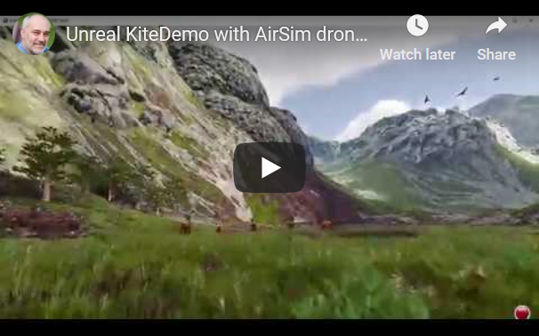

# AirSim is "live" !

So if you love flying quadrocopters, as I do, then you'll probably also love flying them in a simulator.  I recently worked on a cool new Simulator with a colleague in Microsoft Research and it was a blast.  The Unreal Game engine is astounding, I love what it can do with rendering reflections, grass blowing in the wind, shadows created by leaves on the trees that also move as the wind blows.  Amazing stuff.

We built the AirSim simulator because we needed a research platform where we could safely test out reinforcement learning algorithms for vision based control of the drone.  Well, obviously we don't want to have to crash a real drone while it is 'learning', but the problem with existing simulators is they didn't look real enough.  So we built a new drone simulator using Unreal engine and it works great!

