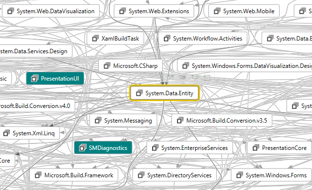
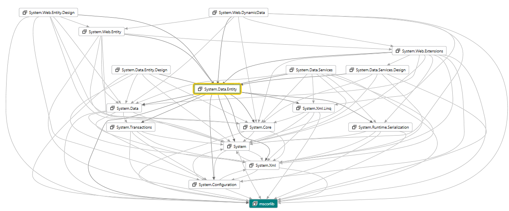
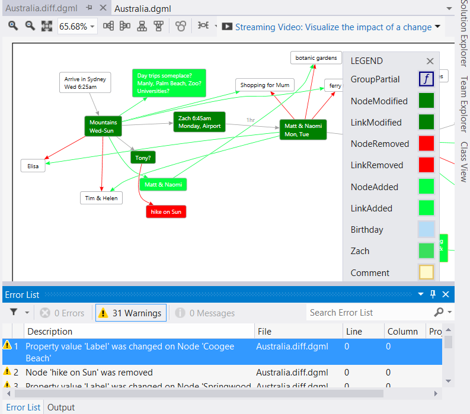

# DGML Power Tools for Visual Studio 2017

If you struggle with complex code dependencies then you might like my [DGML Power Tools for Visual Studio 2017](https://marketplace.visualstudio.com/items?itemName=ChrisLovett.DgmlPowerTools2017).  This addin makes it easy to slice and dice your DGML diagrams and share them with others via SVG.

See my [Demo Video](http://lovettsoftware.com/videos/DGMLPowerTools.mp4).

## Save as SVG
You will see the “Save as SVG” command in the Share menu on the Directed Graph Document toolbar.

 
## Neighborhood mode

On the Directed Graph Document toolbar this command allows you to filter the graph to show only a specified number of degrees of freedom away from the selected node.  If you move the selected node, click the button again to “recenter” the neighborhood on the new selection.  To turn off neighborhood select the “Off” command inside the drop down menu next to the icon on the toolbar.
Neighborhood mode can help when you have messy graphs like this one:

In this case if you only care about one degree of freedom from the selected node then neighborhood mode will give you this nice clean subset:

## Butterfly mode

 

On the Directed Graph Document toolbar this command removes cycles in the graph so that you see only the tree if incoming and outgoing dependencies around the selected node.  This works nicely together with neighborhood mode.  To recompute the butterfly simply click the toolbar button again after moving the selection.  If you add butterfly mode to the above neighborhood example you get this even cleaner graph:

 

Notice the difference between the two graphs is that butterfly mode removed the cycles so you can see a clean picture of incoming and outgoing dependencies relative to the selected node.   Butterly also ensures that the arrows flow in the same direction which makes seeing the dependencies a lot easier.  Just note that in removing cycles there may be some missing circular dependencies which you won’t discover until you move the center of the butterfly.

## Windows Drag/Drop

Simply drag images from Windows Explorer onto the canvas so you can wire them up with links and groups and quickly create some really nice looking diagrams.  In fact you can drag any file on to the canvas to get a node with a Reference attribute pointing at that file
(which is then handy for “Goto->Reference” command).

## Graph Diff

You will see the graph compare command in the Directed Graph Document context menu:

This command compares your current graph with another and then loads the result in a new window showing what was added or removed:

## DGML Filter View

 

A new tool window that allows you to provide auto-grouping information.  If you take the .NET Assemblies.dgml graph for example, and add the following grouping information in the DGML Filter View then click the “Apply Groups” button in the toolbar you will see a nice grouped view of the data.

**Note**: use the number pad +/- keys to re-order the list (use TAB key to make sure list has the keyboard focus).
The following is the result when you apply this grouping information (see [AutoGrouped.dgml](http://www.lovettsoftware.com/LovettSoftware/dgml/Demos/.NET4.0/AutoGrouped.dgml)).

Enjoy!!