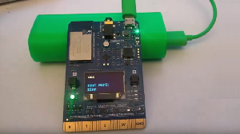

# Fun with keyword spotting

I've had a lot of fun lately playing with Deep Neural Networks (DNNs), pytorch, RNN's and keyword spotting models.
See my [Channel 9 Video](https://channel9.msdn.com/Shows/Internet-of-Things-Show/Running-AI-on-IoT-microcontroller-devices-with-ELL).
This whole DNN thing is rather addictive.  See my latest quick demo:

This has turned into an [official sample app](https://github.com/IoTDevEnvExamples/DevKitKeywordSpotter/) for the
[Azure MXCHIP IOT DevKit](https://microsoft.github.io/azure-iot-developer-kit/) which is a really fun little board
that as a nice little ARM Cortex-M4f chip and a bunch of sensors including a nice microphone.

You can run this puppy using only about 80 milliamps always listening for keywords.  Doesn't have to be "Hey Siri"
or "Hey Google" or "Hey Cortana",  you could [train your own model](https://microsoft.github.io/ELL/tutorials/Training-audio-keyword-spotter-with-pytorch/) that listens to whatever you want.

On my HP z840 dev box with NVidia 1080 I can train using pytorch in about 3 minutes, compile that using the [ELL compiler](https://microsoft.github.io/ELL/tutorials/) in a second, and deploy that to the MXCHIP board using VS code in another few seconds and boom, I'm up and running with an intelligent device!

I'm really liking pytorch these days, it has the flexibility you need to try all kinds of crazy things, and all the researchers seem to be adopting it,
and that's important because the researchers are the ones coming up with all the good algorithms.

So anyone can build an intelligent device,
cross-platform apps to light it up, and cloud services on Azure that reach the entire planet.  The opportunity here is enormous.  I seriously think the opportunity for developers is larger than it has every been.  Think about it, a guy starts [ring.com](https://ring.com/) because he was tired of his neighbor's dog pooping in his front yard, and a few years later Amazon buys it for $1 billion !!  Granted, ring.com executed really well.  But the number of intelligent devices and scenarios that can be imagined is limitless!

## Always listening scenarios...

For example, there are so many things we can do with A.I. on audio streams:

- **fun**: simple interactive toys, "Spot! roll over!"
- **safety**: left the stove on, garage door is still open
- **industrial**: anomaly detection on machines (motor is dying)
- **inclusive**: help deaf people hear things that are going on around them
- **neighborhood**: dog is barking while I'm at work
- **relationships**: my spouse is snoring too loud, here's the proof!
- **health**: detect the sound of sleep apnea, so people can get help

It's so easy to do all this, let's just do it!!

 
