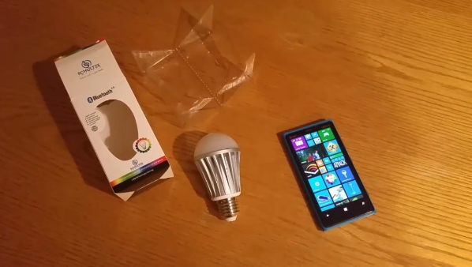

# Magic LED Lights Rock

I had some fun over the Christmas holiday playing with my new toy, [Magic LED Lights](http://www.amazon.com/Bluetooth-LED-Light-Bulb-Multicolor/dp/B00P6WAEHQ/ref=sr_1_1?s=hi&amp;qid=1419413430&amp;sr=1-1).  These are controlled from your phone using Bluetooth Low Energy.  But as is often the case there was no Windows Phone app for these, so hey, it was the holidays, I had some time, so I built one.  Actually, I built a [Windows  app](http://www.windowsphone.com/en-us/store/app/magic-led-lights/62f1577d-df89-4002-b6e9-2462313c35a3).  It is implemented in C# and most of the code is shared between the two apps.

So far the light bulb has worked perfectly!   You can get more information from the manufacturer at [www.ledmagical.com](http://www.ledmagical.com/Apps/BT001EN.html).  Of course, this is just the beginning.  Imagine the lights turn on when I walk into my office.  Or the XBox controls the lights so they turn red when I get shot in Halo. There are many fun applications of this really simple but very cool new tool.

See [Demo Video of bluetooth lights](http://www.lovettsoftware.com/videos/blelights.mp4) and [Demo Video of the wifi lights](http://www.lovettsoftware.com/videos/wifilights.mp4).

