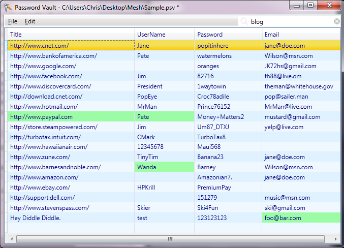
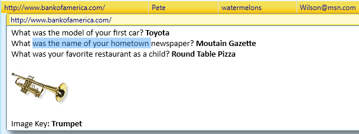

# PasswordVault

See [demo video (mp4 13mb)](http://lovettsoftware.com/videos/PasswordVault.mp4)

[Password Vault](http://www.lovettsoftware.com/downloads/passwordvault/PasswordVault.application) is my latest little ClickOnce app, built on the [.NET Framework 4.0.](http://www.microsoft.com/download/en/details.aspx?id=17851)

NEW: I've also added a windows store app, see [Secure Password Vault app](https://www.microsoft.com/store/apps/9nblggh2l5wv) and associated [new demo video](http://www.lovettsoftware.com/videos/PasswordVault.mp4).

Managing online accounts is a real hassle these days. I have 180 separate userids and passwords to manage. Who can remember all that? And it's not just userids and passwords any more, it's also secret questions, password images, secure credit card numbers, links to specific URLs, license keys, and all sorts of other miscellaneous information associated with my online accounts.

The temptation of course is to get sloppy and use the same user id and password on every site and use real "secret" questions that I can remember but a wise person once said "don't put all your eggs in one basket". If a hacker breaks into one site I don't want them to be able to steal my entire identity across all my other accounts, so I've diligently kept separate unique userids and passwords on every site and fake random unique secret questions. I also use strong passwords, combinations of digits, letters, and other special characters. But managing all this unique secure information for every account is a big hassle.

Up till now I've used a [password encrypted Microsoft Word]9http://office.microsoft.com/en-us/help/password-protect-documents-workbooks-and-presentations-HA010148333.aspx#BM1) file. Being a free-form text editor Word lets me paste anything I want, including all those annoying "secret questions", even password image keys that some sites are now using, like Bank of America. But I want these passwords to be readily available on every machine that I use. Since the Word document is itself password encrypted, I can store it on my OneDrive folder which is automatically copied to all my machines.

But then if I edit the password file on one machine while it is offline then edit the file on another machine before it syncs then I have a conflict and will have to manually merge the two slightly different Word documents which is a real hassle.

So I wanted something that is a bit more structured that can handle automatic merging for me, but also without losing the flexibility of free form text editing for all that other random information besides the core web site, userid and password fields.

So I built [Password Vault](http://www.lovettsoftware.com/downloads/passwordvault/PasswordVault.application).

The screen shot below shows a typical password file. Highlighted in various shades of green are the most recent changes. This green highlight fades over time, disappearing after one month.

When you select a row the 5th field appears containing a full rich text editor where you can paste any other details like secret questions or even an image key. You can cut & paste anything you want into this field and and it can be as big as you want. This field is also searchable.

When the program first starts the focus will be on the search field since you typically have some place in mind already before you launch the app. After you type in your search term (which is not case sensitive) the view will automatically filter down to show any matching rows:

From there you can select the row you want and press F12 to open that URL, and then you can copy the user name and password into the web site login page.

### Implementation

I realize there's a million similar apps out there, I just wanted to see how easy it would be to build one. The following is the solution I came up with.

[Design.dgml (276.06 kb)](http://lovettsoftware.com/LovettSoftware/DGML/Demos/Design/PasswordVault.dgml)

PasswordVault is about 1000 lines of code and shows the power of .NET Framework. It uses the .NET Cryptography api to encrypt/decrypt your password files using 256 bit encryption, and it uses WPF for the User Interface including a RichTextBox for the free form text editing part. PasswordVault also uses the [Microsoft Credential Manager](http://windows.microsoft.com/en-US/windows7/What-is-Credential-Manager) to safely store your master password so you don't have to keep entering the master password every time you open your password file.
