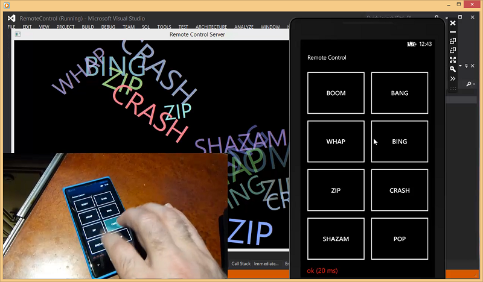

# Remote Control Phone

Have you ever wanted to control your PC using your Windows Phone?  Well it turns out to be surprisingly simple to do.  I found some sample code on MSDN that plays tic-tac-toe and so I took that and made some simple changes.

See [mp4 Video (12mb)](http://www.lovettsoftware.com/downloads/remotecontrol/remotecontrolapp.mp4)
 
Download Source Code: [RemoteControl.zip](http://www.lovettsoftware.com/downloads/remotecontrol/remotecontrol.zip)

