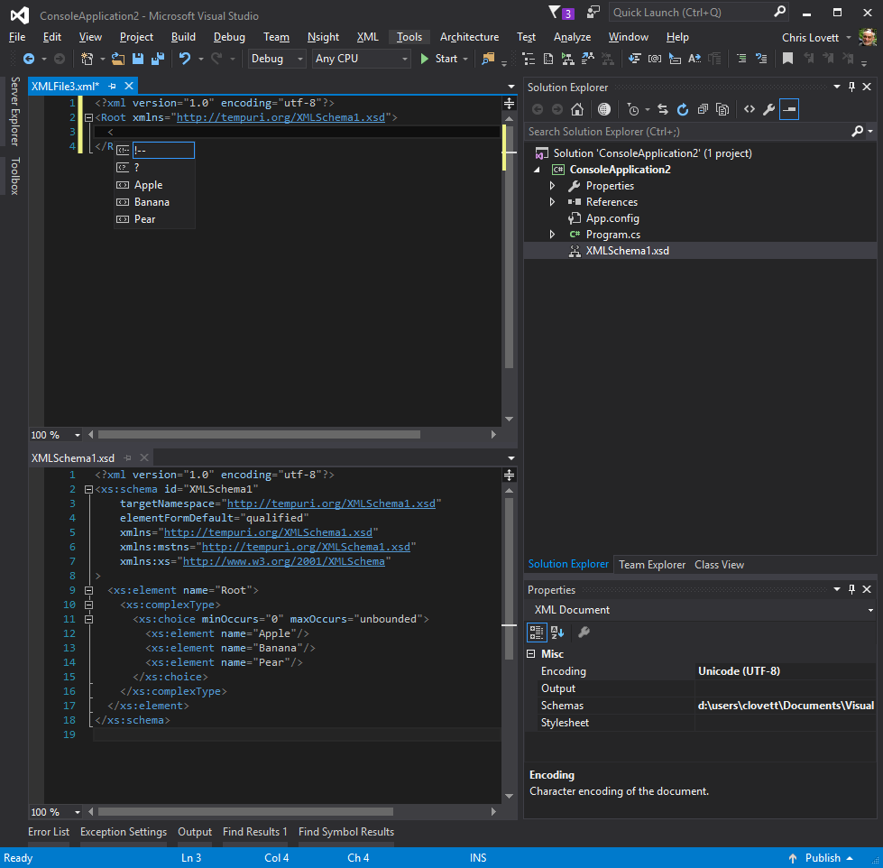
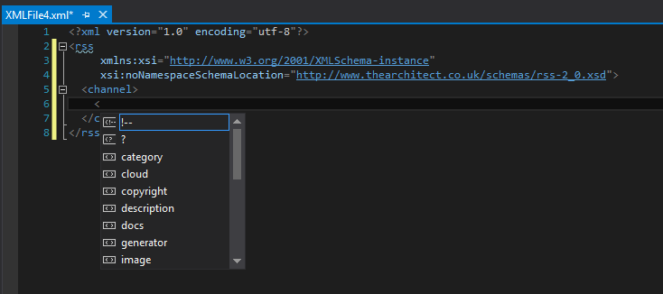
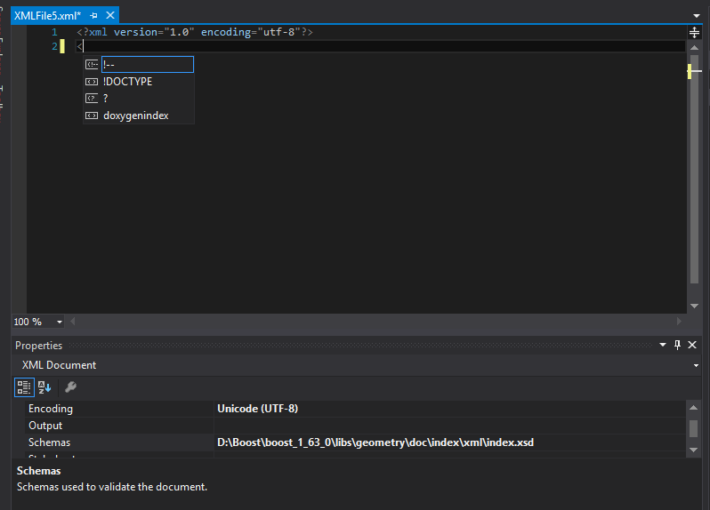

# Visual Studio's lesser-known Xml Schema features

John Tasler made me write this blog.  There I was quietly responding to various emails when John said to me, he said “hey, that would make a great blog”.  So don’t blame me, it was his idea 🙂

What was the question you ask?  Well Ming wanted to know how do you make Visual Studio automatically apply an xsd schema to a newly created XML file ?

**Answer**: You have lots of options.

 If your schema lives in %DevEnvDir%\..\..\Xml\Schemas, or anywhere in your currently loaded “Solution”, then all you need to do is reference the target namespace of your schema like this:
 


But if your schema needs to live some place else (like in the cloud) then you can reference it using xsi namespace trick like this:



But for this to work you have to enable downloads in the XML editor tools options miscellaneous tab (it is off by default):


And you should be sure the owner of the site that publishes this schema is happy with you doing that.  Especially if you are going to encourage lots of users to do the same.Lastly if you have a totally ad-hoc XML and schema location elsewhere you can set one or more schemas to use on a per-document basis using the document Properties windows like this:



If you are building a project item wizard then, you could automate this step if you want using VS automation api.

**SchemaCatalogs**:  But what a lot of people never think to ask is what if I have multiple schemas of different versions that use the same target namespace?

Well for functional completion on this topic, this is where the  SchemaCatalog file comes in:

```xml
<?xml version=“1.0“ encoding=“utf-8“?>
<SchemaCatalog xmlns=“http://schemas.microsoft.com/xsd/catalog“>
…
</SchemaCatalog>
```

See %DevEnvDir%\..\..\Xml\Schemas\catalog.xml for an example.  It can “associate” schemas from other VS directories using %InstallRoot%, and it can associate by file type with conditional expressions.