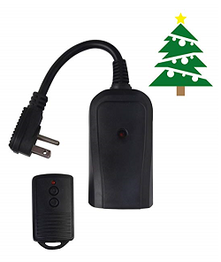
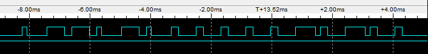

# Wireless Remote Hack

_An Arduino hack on a cheap Wireless Remote Light Switch from Home Depot._

So I bought this remote control switch from Home Depot a couple years ago:

[](https://www.homedepot.com/p/Defiant-Wireless-Indoor-Outdoor-Remote-Plug-RC-009A-1/202296039)

And the battery died in the remote, so I could go find a replacement A53G 12V battery, or I could hack it and control the remote using Arduino.  That way I can turn the lights on and off by computer, based on time of sunset, etc, which is even better than the remote and exactly what I want.  How hard could it be right?

When you open up the remote it looks like a nice simple circuit, unfortunately no one seems to be able to find a datasheet for that IC labelled AUT980202-B1.  But the transmitter is a common 315 MHz transmitter that you can even [get from sparkfun](https://www.sparkfun.com/products/10535), so that's promising.


But since we don't know how the IC is driving the transmitter, it is time to break out the logic analyzer and take a look at the signal coming from the IC.  The IC pin 2 seems to be the pin connected to the transmitter.  There's a couple 0 ohm resistors connected to that trace, so let's probe there.


Pretty soon you will see a set of simple signals at around 20 kHz, and it looks like there is an initial preamble, then the Off and On buttons produce the sequence 0x6814 and 0x6824.  

I had 3 of these remotes and when I looked at all of them I could see 0x68 prefix was in common, the next nibble 0x1 or 0x2 was the on off switch and the last nibble 0x0 to 0xF was the address of the remote switch, so you can do up to 16 unique remotes with this I guess.

Ok, then I grabbed my trusty Arduino Leonardo and bit-banged out a similar signal until the logic analyzer matched as closely as possible.  Here's the Arduino version:



I noticed the original signal did the preamble, then the on or off sequence about 4 times with about 4 ms between each, then repeated with the preamble again.  So I coded up a similar pattern and tried it out.   It didn't work the first time, so I adjusted the timing to be as close as possible, then bingo, it worked as shown in this demo video:

[](https://youtu.be/wQw-xsnpP8o):

In this video I'm using the button to power the transmitter, but the signal is coming from the Arduino, since I severed the link from the AUT980202 chip.  The next step is to bypass the buttons on the remote so the Arduino can decide when to turn the lights on or off, you can also hard wire the 5 volt output from the Arduino and remote the battery.  Turns out 5 volts is enough and it still works.  It may not have the same range, however, when I looked at the actual transmitted signal using my trusty software defined radio, I could see that the 12V battery drives a more powerful signal.  So for best results, you could get another 12V power source instead of the battery, and step that down to 5 volts to power the Arduino.

Lastly, I found that the older version of the remote, that I bought a couple years ago, was essentially the same but it runs the signal at about 2.7 times slower. Perhaps they change the signal speed every now and then to stop the devices from clashing, so no guarentee this code will work on your remote.  But if you find the right scaling factor then you might get lucky.

I used GPIO pin 13 on my board, so the setup is simple:

```cpp
#define CONTROL_PIN LED_BUILTIN

void setup() {
  // initialize digital pin CONTROL_PIN as an output.
  pinMode(CONTROL_PIN, OUTPUT);
}
```

My loop then turns the switch on then off, with a 1 second delay between each using this:

```cpp
void loop() 
{
  //float scale = 2.77; // old remote is slower.
  //uint8_t addr = 0x4; // south lights
  //uint8_t addr = 0xC; // north lights

  float scale = 1; 
  uint8_t addr = 0x0; // new switch
  
  turnOn(addr, scale);
  delay(1000);  
  
  turnOff(addr, scale);
  delay(1000);
}
```

The cool thing is this hacked remote can now turn on any of my remote switches simply by changing the address, and/or the scale on the speed depending on whether I'm controlling old or new switches.  The `turnOn` and `turnOff` functions look similar:

```cpp
void turnOn(uint8_t addr, float scale)
{
  uint16_t onSignal = makeSignal(true, addr);
  sendSignal(onSignal, scale);
}

void turnOff(uint8_t addr, float scale)
{
  uint16_t offSignal = makeSignal(false, addr);
  sendSignal(offSignal, scale);
}
```

where the helper function `makeSignal` combines the prefix 0x68 with the on/off nibble and the address nibble:

```cpp
uint16_t makeSignal(bool on, uint8_t addr)
{
   uint16_t signal = 0x68;
   signal <<= 4;
   if (on) {
    signal += 0x2;
   }
   else {
     signal += 0x1;
   }   
   signal <<= 4;
   signal += (0xF & addr);
   return signal;
}
```

and the `sendSignal` function writes the preamble, and 4 repetitions of the signal, just to be sure.  This seems reliable enough, but you could increase this repetition to whatever number you need to get 100% reliability.

```cpp
void sendSignal(uint16_t signal, float scale)
{
  writePreamble(48, scale);
  delay(4);
  for (int i = 0; i < 4; i++) {
    writeBits(signal, scale);
    delay((int)(4.0 * scale));
  } 
}
```

Ok, now down to the actual bit banging on the output line, simply raising it HIGH and LOW at the right time, the `writePreamble` does 48 fast pulses, at 200 microseconds:

```cpp
void writePreamble(int len, float scale)
{
  for (int i = 0; i < len ; i++)
  {
    digitalWrite(CONTROL_PIN, HIGH);
    delayMicroseconds((int)(200.0 * scale));
    digitalWrite(CONTROL_PIN, LOW); 
    delayMicroseconds((int)(200.0 * scale));
  }
}
```

And `writeBits` writes out our sequence (like 0x671C) by bit shifting over that signal.  Each bit starts with a rising edge then for a 1 bit, it keeps the pulse high for 600 microseconds, for a 0 bit, it drops that after 200 microseconds and leaves it low for the remaining 400 microseconds, then there's a 200 microsecond low until the next bit.  

```cpp
void writeBits(uint16_t signal, float scale)
{
  for (int i = 0; i < 16 ; i++)
  {
    int bit = (signal & 0x8000);
    digitalWrite(CONTROL_PIN, HIGH);
    if (bit) {      
      delayMicroseconds((int)(610.0 * scale));
    } else {
      delayMicroseconds((int)(200.0 * scale));
      digitalWrite(CONTROL_PIN, LOW); 
      delayMicroseconds((int)(410.0 * scale));
    }
    digitalWrite(CONTROL_PIN, LOW);
    delayMicroseconds((int)(210.0 * scale));
    signal <<= 1; 
  }
}
```

The exact numbers used in these `delayMicroseconds` calls is needed to match the signal from the IC chip, and the lack of neat round numbers here is probably because the internal oscillators on the IC versus the Arduino are slightly different.  But this seems to work.  The scale factor in the code is just so that I can control old and new remote switches with the same code.

See [Arduino Source Code](https://github.com/lovettchris/lovettchris.github.io/blob/master/posts/wireless_remote/Remote.ino).

Now hook that up to a nice little Python script to toggle the lights at sunrise and sunset: [Python Source Code](https://github.com/lovettchris/lovettchris.github.io/blob/master/posts/wireless_remote/Lights.py).

Fun!